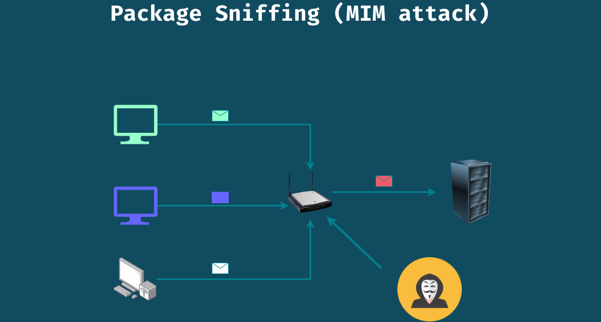

<h1 align="center">Personal Privacy<h1>

## 1. Safe Browsing

1. Disable request to save password
2. Use incognito mode
3. use password manager
4. Be caution while using http website

## Demonstration

- Go to `http://testphp.vulnweb.com/`
- `sudo wireshark`
- capture the packet and look using filter `http.request.method=="POST"`
