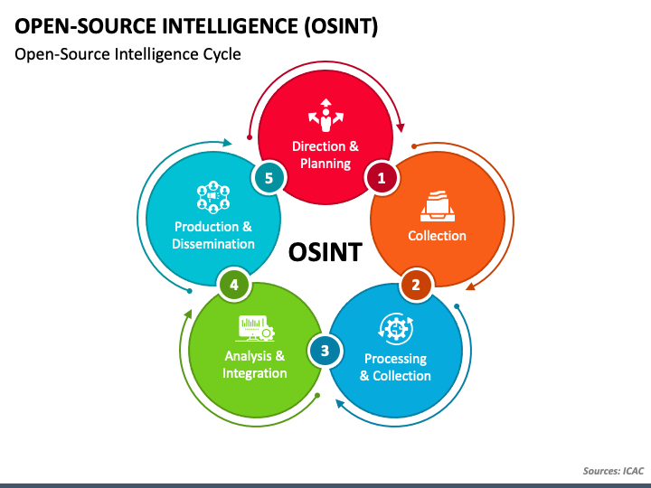

# Open-source Intelligence (OSINT)

## What is OSINT (`TCM security` definition)

OSINT is a mulit-methods methodology for 
- collection
- analyzing and
- making decision 

about data accessible in publicly available source to be used in intelligence context.

The term `open` refer to `publicly available sources`

## OSINT life cycle

## Creating Sock Puppets 

the term 'sock puppet' comes from the Oxford English dictionary "a person whose actions are controlled by another; a minion"

- This means that you have to think long term when it comes to growing a fully fleshed out sock account, you have to start growing and nurturing them a long time before you will actually need them

- Detail about sock puppets can be read in [The Art of Sock Puppets](https://www.secjuice.com/the-art-of-the-sock-osint-humint/)

- Fake ID Generator [Fake_id_generator](https://www.fakenamegenerator.com/)

- Fake Photo generated by AI [Fake_Photo](https://thispersondoesnotexist.com)

- Process for setting up anomymous puppets[Setting_puppets](https://www.reddit.com/r/OSINT/comments/dp70jr/my_process_for_setting_up_anonymous_sockpuppet/)

## Google Hacking

## Reverse Image Search
