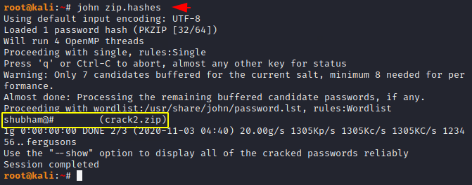

# Cracking `.zip` password with john the ripper

## 1. Use `zip2john` tool to make hash

`zip2john test.zip > zip.hashes`

## 2. Crack password with `john`

`john zip.hashes`

## Cracking with custom wordlist

`john --wordlist=wordlist.txt zip.hashes`

